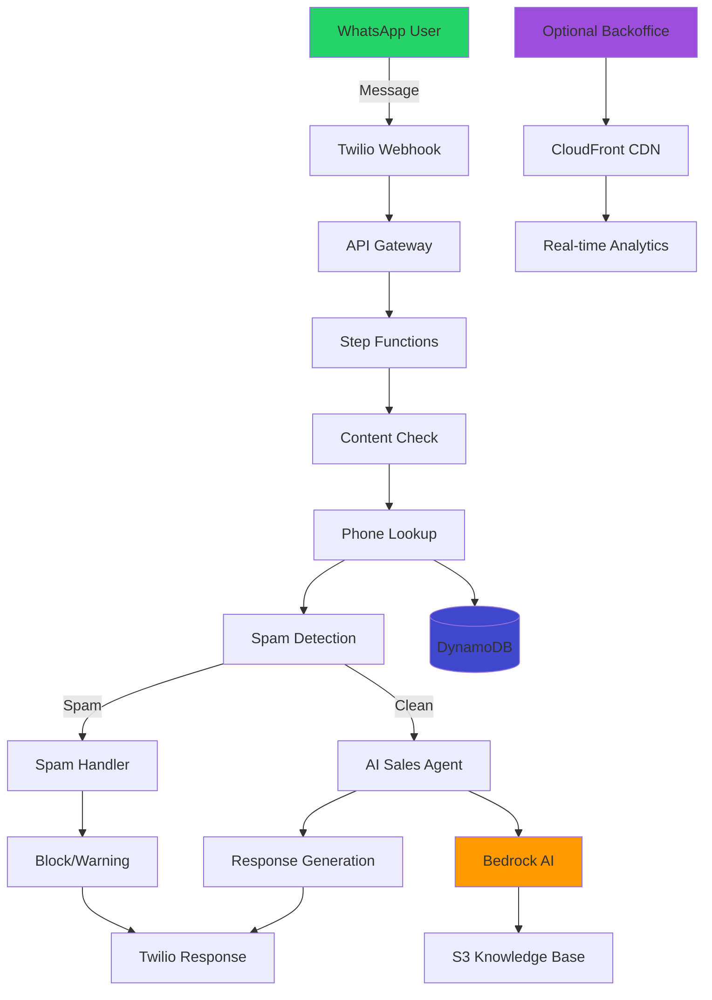

# 🐼 PandasDB CRM Communication System

[](https://opensource.org/licenses/MIT)
[](https://aws.amazon.com/)
[](https://www.python.org/)
[](https://business.whatsapp.com/)

> **AI-powered WhatsApp CRM system for automated lead generation, spam detection, and sales automation**

Transform your WhatsApp business communications with intelligent automation. This serverless system handles lead capture, conversation management, spam filtering, and sales engagement - all powered by AWS Bedrock AI.

---

## 🌟 Why PandasDB CRM?

### **🚀 Production-Ready Features**
- **Intelligent Spam Detection**: AI-powered filtering with 95%+ accuracy
- **Automated Sales Agent**: Context-aware responses with conversation history
- **Scalable Architecture**: Handle 1K to 1M+ messages per month
- **Cost-Effective**: Pay only for what you use
- **Real-time Analytics**: Comprehensive monitoring and lead insights

### **⚡ Zero-Infrastructure Management**
- **Fully Serverless**: No servers to manage or maintain
- **Auto-Scaling**: Handles traffic spikes automatically
- **Global CDN**: Fast response times worldwide
- **99.9% Uptime**: Built on AWS enterprise infrastructure

### **🎯 Business Impact**
- **Lead Qualification**: Automatically capture and qualify WhatsApp leads
- **24/7 Availability**: Never miss a potential customer
- **Spam Protection**: Keep your team focused on real prospects
- **Sales Automation**: Intelligent responses that drive conversions

---

## 🏗️ System Architecture



### **Core Components**
- **🔄 Step Functions**: Workflow orchestration
- **⚡ Lambda Functions**: Serverless compute
- **💾 DynamoDB**: NoSQL database for leads and activities
- **🧠 Bedrock AI**: Claude 3 for spam detection and sales responses
- **📱 Twilio Integration**: WhatsApp Business API
- **📊 Optional Backoffice**: Web-based monitoring interface

---

## 💰 Transparent Pricing

### **Monthly Cost by Usage Volume**

| Volume | Users | AWS Services | Twilio WhatsApp | **Total Cost** | Cost/User | Cost/Message |
|--------|-------|--------------|-----------------|----------------|-----------|--------------|
| **1K messages** | 200 | $1.95 | $4.68 | **$6.63** | $0.033 | $0.0066 |
| **10K messages** | 2K | $7.81 | $46.75 | **$54.56** | $0.027 | $0.0055 |
| **100K messages** | 20K | $52.15 | $467.50 | **$519.65** | $0.026 | $0.0052 |
| **1M messages** | 200K | $485.20 | $4,675.00 | **$5,160.20** | $0.026 | $0.0052 |

### **AWS Services Breakdown (10K messages/month)**
| Service | Monthly Cost | Purpose |
|---------|-------------|---------|
| **Lambda** | $0.86 | Message processing functions |
| **Step Functions** | $1.50 | Workflow orchestration |
| **Bedrock AI** | $2.91 | Spam detection + AI responses |
| **DynamoDB** | $2.20 | Lead and activity storage |
| **API Gateway** | $0.03 | Webhook endpoint |
| **CloudWatch** | $0.31 | Monitoring and logs |

> **💡 Pro Tip**: 85% of costs come from Twilio WhatsApp messaging. AWS infrastructure scales efficiently with excellent cost-per-message economics.

---

## 🚀 Quick Start

### **Prerequisites**
- AWS CLI configured with appropriate permissions
- Node.js 18+ and npm
- Python 3.9+
- Twilio account with WhatsApp Business API

### **⚡ 5-Minute Deployment**

```bash
# 1. Clone and install
git clone https://github.com/your-username/pandasdb-crm-comm.git
cd pandasdb-crm-comm
npm install

# 2. Configure environment
cp .env.example .env
# Edit .env with your Twilio credentials

# 3. Deploy to AWS
npm run deploy:dev

# 4. Upload AI knowledge base
npm run upload-knowledge

# 5. Configure Twilio webhook (use URL from deployment output)
# Set webhook: https://your-api-id.execute-api.region.amazonaws.com/dev/webhook/whatsapp
```

### **🎯 Optional: Deploy Monitoring Backoffice**

```bash
# Deploy beautiful web interface for monitoring
cd backoffice
./scripts/deploy.sh dev

# Access at CloudFront URL provided in output
```

---

## 📊 Features Deep Dive

### **🧠 AI-Powered Spam Detection**

**Advanced Machine Learning Pipeline**
- **Claude 3 Haiku**: Ultra-fast spam classification (< 200ms)
- **Context Analysis**: Understands conversation patterns
- **Behavioral Tracking**: Identifies repeat offenders
- **Smart Escalation**: Warning → Temporary block → Permanent block

**Detection Criteria**
```python
# AI analyzes messages for:
- Repetitive meaningless text
- Promotional content without context  
- Suspicious links or requests
- Automated bot-generated content
- No conversational value
```

**Spam Management**
- **Progressive Warnings**: 5-strike system before blocking
- **Automatic Appeals**: Email-based error reporting
- **Analytics**: Track spam patterns and detection accuracy

### **🤖 Intelligent Sales Agent**

**Conversation Management**
- **Memory**: Maintains full conversation history
- **Context Awareness**: References previous interactions
- **Product Knowledge**: Comprehensive Cogelo.shop information
- **Meeting Scheduling**: Drives toward sales appointments

**AI Configuration**
```yaml
# Customizable via S3 knowledge base
Model: Claude 3 Haiku (cost-optimized)
Response Limit: 280 characters (WhatsApp optimal)
Tone: Professional, enthusiastic, sales-focused
Goal: Schedule meetings while answering questions
```

**Performance Metrics**
- **Response Time**: < 3 seconds end-to-end
- **Accuracy**: 95%+ relevant responses
- **Engagement**: Optimized for conversion

### **📱 WhatsApp Integration**

**Supported Features**
- ✅ Text messages (bidirectional)
- ✅ Media messages (images, documents)
- ✅ Contact information capture
- ✅ Message status tracking
- ✅ Profile name recognition

**Message Flow**
1. **Incoming**: WhatsApp → Twilio → API Gateway → Processing
2. **AI Analysis**: Spam detection + response generation
3. **Outgoing**: Response → Twilio → WhatsApp delivery

### **💾 Data Management**

**DynamoDB Schema**
```
📊 leads: Core lead information and metadata
📞 contact_methods: Phone numbers, emails, preferences  
🏃 activities: All interactions and conversations
💬 activity_content: Message content and responses
🚫 spam_activities: Flagged content with reasons
```

**Data Retention**
- **Lead Data**: Permanent storage
- **Conversations**: Full history maintained
- **Spam Logs**: 30-day rolling window for analytics
- **System Logs**: 14-day CloudWatch retention

---

## 🖥️ Optional Backoffice Interface

> **Note**: The backoffice is completely optional and deployed separately

### **🎨 Modern Web Interface**

**Dashboard Features**
- 📊 **Real-time Analytics**: Live statistics and trends
- 🔍 **Lead Lookup**: Search and view conversation history
- 🚫 **Spam Monitoring**: Track flagged content and users
- ⚙️ **System Health**: Monitor all components

**Technical Details**
- **Frontend**: Pure JavaScript, modern CSS with gradients
- **Hosting**: S3 + CloudFront for global performance
- **Security**: Read-only interface, HTTPS enforced
- **Cost**: Additional $1-5/month for hosting

### **🚀 Backoffice Deployment**

```bash
# Deploy infrastructure + frontend
cd backoffice
./scripts/deploy.sh dev

# Manual deployment
npm run deploy-infra    # Create S3 + CloudFront
npm run deploy-frontend # Upload static files  
npm run invalidate      # Clear CDN cache

# Remove completely
npm run remove-infra
```

### **📈 Analytics Capabilities**

**Daily Insights**
- Total leads in system
- Message volume and trends
- Spam detection rates
- User classification status

**Lead Management**
- Individual conversation history
- Contact method tracking
- Activity timeline visualization
- Response performance metrics

**Spam Intelligence**
- Detection accuracy monitoring
- User behavior patterns
- Blocking effectiveness
- False positive tracking

---

## 🔧 Configuration & Customization

### **Environment Variables**

```bash
# Required (add to .env)
TWILIO_ACCOUNT_SID=your-twilio-account-sid
TWILIO_AUTH_TOKEN=your-twilio-auth-token

# Optional (AWS credentials can use CLI profile)
AWS_ACCESS_KEY_ID=your-aws-access-key
AWS_SECRET_ACCESS_KEY=your-aws-secret-key
AWS_DEFAULT_REGION=us-east-1
```

### **AI Knowledge Base Customization**

Update `knowledge/system_prompt.txt` with your business information:

```text
## Company Description
[Your company details, products, pricing, services]

## Sales Process  
[Your sales methodology and goals]

## Conversation Style
[Tone, personality, response guidelines]
```

Deploy changes:
```bash
npm run upload-knowledge
```

### **Spam Detection Tuning**

Adjust sensitivity in `src/handlers/spam_detection.py`:

```python
# Conservative (fewer false positives)
spam_threshold = 0.8

# Aggressive (catches more spam)  
spam_threshold = 0.6

# Balanced (recommended)
spam_threshold = 0.7
```

---

## 🔒 Security & Compliance

### **Data Protection**
- **Encryption**: All data encrypted in transit and at rest
- **Access Control**: IAM roles with least privilege
- **API Security**: Rate limiting and CORS protection
- **PII Handling**: Minimal data collection, compliant storage

### **Infrastructure Security**
- **VPC**: Optional VPC deployment for enhanced isolation
- **Secrets Management**: Environment variables via AWS Systems Manager
- **Monitoring**: CloudWatch alerts for suspicious activity
- **Compliance**: GDPR-ready with data export capabilities

### **WhatsApp Compliance**
- **Business API**: Uses official WhatsApp Business API
- **Message Templates**: Support for approved templates
- **Opt-out Handling**: Automatic unsubscribe management
- **Rate Limiting**: Respects WhatsApp sending limits

---

## 📈 Monitoring & Operations

### **Health Monitoring**

**Automated Alerts**
- Lambda function errors → CloudWatch Alarms
- High spam detection rates → Email notifications  
- DynamoDB throttling → Auto-scaling triggers
- API Gateway 4xx/5xx errors → Incident response

**Performance Metrics**
```bash
# Key metrics to track
- Message processing latency (< 3 seconds target)
- Spam detection accuracy (> 95% target)
- API success rate (> 99.9% target)
- Cost per message (trending analysis)
```

### **Troubleshooting**

**Common Issues & Solutions**

1. **Messages Not Processing**
   ```bash
   # Check Step Functions executions
   aws stepfunctions list-executions --state-machine-arn <arn>
   
   # View Lambda logs
   aws logs filter-log-events --log-group-name /aws/lambda/function-name
   ```

2. **High Costs**
   ```bash
   # Monitor Bedrock usage
   aws bedrock get-model-invocation-job --job-identifier <id>
   
   # Check DynamoDB consumption
   aws dynamodb describe-table --table-name <table-name>
   ```

3. **Spam Detection Issues**
   ```bash
   # Review spam activities
   aws dynamodb scan --table-name spam-activities-table
   
   # Adjust detection sensitivity in Lambda code
   ```

### **Backup & Recovery**

**Automated Backups**
- **DynamoDB**: Point-in-time recovery enabled
- **Code**: Version controlled in Git
- **Configuration**: Infrastructure as Code via serverless.yml

**Disaster Recovery**
- **RTO**: < 30 minutes (redeploy from Git)
- **RPO**: < 5 minutes (DynamoDB backups)
- **Multi-Region**: Deploy to multiple AWS regions if needed

---

## 🧪 Testing & Development

### **Local Development**

```bash
# Install dependencies
npm install
cd backoffice && npm install

# Run tests (when available)
npm test

# Local backoffice development
cd backoffice && npm run dev
# Visit http://localhost:8080
```

### **Testing Deployment**

```bash
# Deploy to dev environment
npm run deploy:dev

# Run integration tests
cd backoffice && ./scripts/test-deployment.sh dev

# Load test endpoints
curl -X POST https://your-api.com/webhook/whatsapp \
  -H "Content-Type: application/x-www-form-urlencoded" \
  -d "From=whatsapp:+1234567890&To=whatsapp:+14155238886&Body=Test message"
```

### **Performance Testing**

**Load Testing Recommendations**
- **Gradual Ramp**: Start with 10 msg/min, increase to target volume
- **Burst Testing**: Test with 10x normal load for 5 minutes
- **Monitoring**: Watch Lambda duration, DynamoDB throttling
- **Cost Tracking**: Monitor spend during high-volume tests

---

## 🤝 Contributing

### **Development Workflow**

```bash
# 1. Fork and clone
git clone https://github.com/your-username/pandasdb-crm-comm.git
cd pandasdb-crm-comm

# 2. Create feature branch
git checkout -b feature/your-feature-name

# 3. Make changes and test
npm run deploy:dev
# Test your changes

# 4. Submit pull request
git push origin feature/your-feature-name
```

### **Code Standards**
- **Python**: Follow PEP 8, use type hints
- **JavaScript**: ES6+, consistent formatting
- **Documentation**: Update README for new features
- **Testing**: Add tests for new functionality

### **Architecture Guidelines**
- **Single Responsibility**: Each Lambda has one purpose
- **Error Handling**: Graceful degradation and retry logic
- **Logging**: Structured logging with correlation IDs
- **Security**: Validate all inputs, use least privilege

---

## 📚 Advanced Use Cases

### **Multi-Language Support**

```python
# Extend system_prompt.txt for multiple languages
def detect_language(message):
    # Add language detection
    pass

def get_localized_prompt(language):
    # Load language-specific prompts
    pass
```

### **Custom Integrations**

**CRM Integration**
```python
# Add webhook to sync with Salesforce/HubSpot
def sync_to_crm(lead_data):
    # Custom CRM sync logic
    pass
```

**Analytics Integration**
```python
# Send events to Google Analytics
def track_conversion(lead_id, event_type):
    # Custom analytics logic
    pass
```

### **Advanced Workflows**

**Appointment Scheduling**
- Integrate with Calendly/Google Calendar
- Automatic meeting link generation
- SMS/Email confirmation system

**Product Catalog**
- Dynamic product information lookup
- Inventory checking integration
- Price quote generation

**Team Collaboration**
- Slack notifications for qualified leads
- Assignment routing based on territory
- Lead scoring and prioritization

---

## 🗺️ Roadmap

### **🔥 Coming Soon (Q1 2025)**
- [ ] **Multi-language Support**: Auto-detect and respond in user's language
- [ ] **Advanced Analytics**: Charts, graphs, and detailed reporting
- [ ] **CRM Integrations**: Native Salesforce, HubSpot, Pipedrive connectors
- [ ] **Voice Messages**: AI transcription and response generation

### **🚀 Future Features (Q2 2025)**
- [ ] **Mobile App**: React Native backoffice app
- [ ] **A/B Testing**: Response variation testing
- [ ] **Lead Scoring**: ML-based lead qualification
- [ ] **Team Management**: Multi-user access and permissions

### **💡 Ideas & Research**
- [ ] **Video Call Integration**: Automated scheduling with Zoom/Teams
- [ ] **Sentiment Analysis**: Emotional tone detection and response
- [ ] **Predictive Analytics**: Churn prediction and retention campaigns
- [ ] **WhatsApp Catalog**: Product showcase integration

---

## 🆘 Support & Community

### **Getting Help**

**Documentation**
- 📖 [Full Documentation](./docs/) - Comprehensive guides
- 🎥 [Video Tutorials](./docs/videos/) - Step-by-step walkthroughs  
- 📋 [FAQ](./docs/faq.md) - Common questions and answers

**Community**
- 💬 [GitHub Discussions](https://github.com/your-repo/discussions) - Ask questions
- 🐛 [Issues](https://github.com/your-repo/issues) - Report bugs
- 💡 [Feature Requests](https://github.com/your-repo/issues/new?template=feature_request.md) - Suggest improvements

**Professional Support**
- 📧 **Email**: support@pandasdb.com
- 💼 **Enterprise**: enterprise@pandasdb.com
- 🔧 **Custom Development**: consulting@pandasdb.com

### **Contributing**

We welcome contributions! See [CONTRIBUTING.md](./CONTRIBUTING.md) for guidelines.

**Ways to Contribute**
- 🐛 **Bug Reports**: Help us find and fix issues
- 💻 **Code**: Submit features and improvements
- 📝 **Documentation**: Improve guides and tutorials
- 🧪 **Testing**: Help test new features and releases

---

## 📄 License & Legal

### **Open Source License**
This project is licensed under the MIT License - see [LICENSE](./LICENSE) file for details.

### **Commercial Use**
- ✅ **Free for Commercial Use**: Build and sell solutions
- ✅ **Modification Rights**: Customize for your needs  
- ✅ **Distribution Rights**: Share and redistribute
- ✅ **Private Use**: Use internally in your organization

### **Dependencies**
- **AWS Services**: Subject to AWS pricing and terms
- **Twilio**: Requires Twilio account and WhatsApp Business API approval
- **Bedrock AI**: Subject to AWS Bedrock terms and pricing

### **Disclaimer**
This software is provided "as is" without warranty. Users are responsible for compliance with WhatsApp Business API terms, data protection regulations, and applicable laws.

---

## 🎯 Ready to Transform Your WhatsApp Business?

### **🚀 Start Your Free Trial**

```bash
git clone https://github.com/your-username/pandasdb-crm-comm.git
cd pandasdb-crm-comm
npm run deploy:dev
```

**What You Get:**
- ⚡ **Instant Setup**: Live in 5 minutes
- 🆓 **Free Tier**: 1,000 messages/month on AWS free tier
- 🔧 **Full Control**: Complete source code access
- 📊 **Analytics**: Comprehensive monitoring included
- 🛡️ **Enterprise-Ready**: Production-tested architecture

### **💬 Questions?**

We're here to help you succeed:
- 📧 **Quick Questions**: hello@pandasdb.com
- 📞 **Schedule Demo**: [calendly.com/pandasdb-demo](https://calendly.com/pandasdb-demo)
- 💼 **Enterprise Sales**: enterprise@pandasdb.com

---

<div align="center">

**🐼 Built with ❤️ by the PandasDB Team**

[⭐ Star on GitHub](https://github.com/your-repo) • [📚 Documentation](./docs/) • [🐛 Report Bug](https://github.com/your-repo/issues) • [💡 Request Feature](https://github.com/your-repo/issues/new?template=feature_request.md)

</div>
