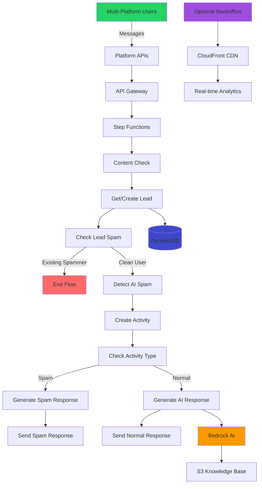

# 🐼 PandasDB CRM Communication System

[](https://opensource.org/licenses/MIT)
[](https://aws.amazon.com/)
[](https://www.python.org/)
[](https://business.whatsapp.com/)
[](https://core.telegram.org/bots)

> **AI-powered multi-platform CRM system for automated lead generation, spam detection, and sales automation**

Transform your business communications with intelligent automation across multiple platforms. This serverless system handles lead capture, conversation management, spam filtering, and sales engagement - all powered by AWS Bedrock AI.

**Supported Platforms**: WhatsApp, Telegram, Chat API (and easily extensible for more)

---

## 📋 Table of Contents

### **🎯 Getting Started**
- [Why PandasDB CRM?](#-why-pandasdb-crm) - Key benefits and business impact
- [Quick Start](#-quick-start) - 5-minute deployment guide
- [Transparent Costs](#-transparent-costs) - Cost breakdown and estimates

### **⚙️ Advanced Usage**
- [Configuration & Customization](#-configuration--customization) - Environment setup
- [API Rate Limiting & Protection](#-api-rate-limiting--protection) - Security measures
- [Modifying Lambda Functions & Workflow](#-modifying-lambda-functions--workflow) - Development guide

### **🏗️ Project Structure & Development**
- [Repository Structure](#-repository-structure) - File organization
- [System Architecture](#️-system-architecture) - High-level technical overview
- [Testing & Development](#-testing--development) - Local development workflow

### **🔧 Features & Technical Details**
- [Features Deep Dive](#-features-deep-dive) - AI spam detection, sales agent, multi-platform integration
- [Security & Compliance](#-security--compliance) - Data protection and compliance
- [Optional Backoffice Interface](#️-optional-backoffice-interface) - Web monitoring dashboard

### **🚀 Operations & Maintenance**
- [Monitoring & Operations](#-monitoring--operations) - Health monitoring and troubleshooting
- [Contributing](#-contributing) - Development workflow and guidelines
- [License & Legal](#-license--legal) - Legal information and commercial use

---

## 🌟 Why PandasDB CRM?

### **🚀 Production-Ready Features**
- **Intelligent Spam Detection**: AI-powered filtering with 95%+ accuracy
- **Automated Sales Agent**: Context-aware responses with conversation history
- **Multi-Platform Support**: WhatsApp, Telegram, Chat API, and easily extensible
- **Scalable Architecture**: Handle 1K to 1M+ messages per month
- **Cost-Effective**: Pay only for what you use
- **Real-time Analytics**: Comprehensive monitoring and lead insights

### **⚡ Zero-Infrastructure Management**
- **Fully Serverless**: No servers to manage or maintain
- **Auto-Scaling**: Handles traffic spikes automatically
- **Global CDN**: Fast response times worldwide
- **99.9% Uptime**: Built on AWS enterprise infrastructure

### **🎯 Business Impact**
- **Lead Qualification**: Automatically capture and qualify leads across platforms
- **24/7 Availability**: Never miss a potential customer
- **Spam Protection**: Keep your team focused on real prospects
- **Sales Automation**: Intelligent responses that drive conversions

---

## 🚀 Quick Start

### **Prerequisites**
- AWS CLI configured with appropriate permissions
- Node.js 18+ and npm
- Python 3.9+
- Platform accounts: Twilio (WhatsApp Business API), Telegram Bot (optional)

### **⚡ 5-Minute Deployment**

```bash
# 1. Clone and install
git clone https://github.com/your-username/pandasdb-crm-comm.git
cd pandasdb-crm-comm
npm install

# 2. Configure environment
cp .env.example .env
# Edit .env with your platform credentials:
# export TWILIO_ACCOUNT_SID=your_actual_sid_here
# export TWILIO_AUTH_TOKEN=your_actual_token_here
# export TELEGRAM_BOT_TOKEN=your_telegram_bot_token (optional)

# 3. Deploy to AWS
npm run deploy:dev

# 4. Upload AI knowledge base (automatically included in deploy:dev)
# npm run upload-knowledge

# 5. Configure platform webhooks (use URLs from deployment output)
# WhatsApp: https://your-api-id.execute-api.region.amazonaws.com/dev/whatsapp
# Telegram: https://your-api-id.execute-api.region.amazonaws.com/dev/telegram
# Chat API: https://your-api-id.execute-api.region.amazonaws.com/dev/chat
```

### **🎯 Optional: Deploy Monitoring Backoffice**

```bash
# Deploy beautiful web interface for monitoring
cd backoffice
./scripts/deploy.sh dev

# Access at CloudFront URL provided in output
```

---

## 💰 Transparent Costs

### **Monthly Cost by Usage Volume**

| Volume | Users | AWS Services | Platform Costs* | **Total Cost** | Cost/User | Cost/Message |
|--------|-------|--------------|----------------|----------------|-----------|--------------|
| **1K messages** | 200 | $1.95 | $4.68 | **$6.63** | $0.033 | $0.0066 |
| **10K messages** | 2K | $7.81 | $46.75 | **$54.56** | $0.027 | $0.0055 |
| **100K messages** | 20K | $52.15 | $467.50 | **$519.65** | $0.026 | $0.0052 |
| **1M messages** | 200K | $485.20 | $4,675.00 | **$5,160.20** | $0.026 | $0.0052 |

*Platform costs shown for WhatsApp via Twilio. Telegram and Chat API are free.

### **AWS Services Breakdown (10K messages/month)**
| Service | Monthly Cost | Purpose |
|---------|-------------|---------|
| **Lambda** | $0.86 | Message processing functions |
| **Step Functions** | $1.50 | Workflow orchestration |
| **Bedrock AI** | $2.91 | Spam detection + AI responses |
| **DynamoDB** | $2.20 | Lead and activity storage |
| **API Gateway** | $0.03 | Webhook endpoints |
| **CloudWatch** | $0.31 | Monitoring and logs |

> **💡 Pro Tip**: 85% of costs come from WhatsApp messaging. Telegram and Chat API are free, making them cost-effective alternatives. AWS infrastructure scales efficiently with excellent cost-per-message economics.

---

## 🔧 Configuration & Customization

### **Environment Variables**

```bash
# Required for WhatsApp (add to .env)
TWILIO_ACCOUNT_SID=your-twilio-account-sid
TWILIO_AUTH_TOKEN=your-twilio-auth-token

# Optional for Telegram
TELEGRAM_BOT_TOKEN=your-telegram-bot-token

# Optional (AWS credentials can use CLI profile)
AWS_ACCESS_KEY_ID=your-aws-access-key
AWS_SECRET_ACCESS_KEY=your-aws-secret-key
AWS_DEFAULT_REGION=us-east-1
```

### **Platform Setup**

**WhatsApp Setup**:
1. Create Twilio account and get WhatsApp Business API access
2. Set webhook URL: `https://your-api.com/whatsapp`

**Telegram Setup**:
1. Create bot via [@BotFather](https://t.me/botfather)
2. Get bot token and add to environment variables
3. Set webhook: `curl -X POST "https://api.telegram.org/bot{BOT_TOKEN}/setWebhook" -d "url=https://your-api.com/telegram"`

**Chat API Setup**:
1. Use the provided API key from deployment output
2. Send POST requests to: `https://your-api.com/chat`
3. Include `X-API-Key` header for authentication

### **AI Knowledge Base Customization**

Update `knowledge/system_prompt.txt` with your business information:

```text
## Company Description
[Your company details, products, pricing, services]

## Sales Process  
[Your sales methodology and goals]

## Conversation Style
[Tone, personality, response guidelines]
```

Deploy changes:
```bash
npm run deploy:dev  # Automatically uploads config and knowledge
```

### **Spam Detection Tuning**

Adjust settings in `config/business.yml`:

```yaml
spam_detection:
  # List of [days, max_spam_activities] tuples - user marked as spammer if exceeds limit
  spam_activities_limits: 
    - [30, 5]  # 5 spam activities in 30 days
  
  # List of [days, max_messages] tuples - user marked as spammer if exceeds limit
  message_limits:
    - [1, 50]    # 50 messages in 1 day
    - [7, 200]   # 200 messages in 7 days
    - [30, 600]  # 600 messages in 30 days
  
  # Warning threshold offset - warn user when they reach (limit - offset) messages
  warning_threshold_offset: 5
  
  # AI confidence thresholds for spam detection
  ai_confidence_threshold: 0.7
  fallback_confidence: 0.7
```

---

## 🚦 API Rate Limiting & Protection

### **Current Protection Settings**

Your webhook endpoints have built-in protection against abuse and excessive requests:

```yaml
# Current limits in infra/lambda-functions.yml
whatsappWebhook:
  reservedConcurrency: 10    # Max 10 concurrent Lambda executions
  events:
    - http:
        path: /whatsapp
        method: post
        throttle:
          rate: 10           # 10 requests per second
          burst: 20          # 20 concurrent requests max

telegramWebhook:
  reservedConcurrency: 10
  events:
    - http:
        path: /telegram
        method: post

chatApi:
  events:
    - http:
        path: /chat
        method: post
        private: true        # Requires API key authentication
```

### **Cost Protection Analysis**

With these limits, the **maximum daily cost** from malicious attacks is capped at approximately **$3.91/day** (~$117/month), as invalid requests are rejected quickly by platform signature validation before triggering expensive downstream services.

### **Customizing Rate Limits**

Modify `infra/lambda-functions.yml` to adjust protection levels:

```yaml
whatsappWebhook:
  handler: src/handlers/phone/whatsapp_webhook.lambda_handler
  reservedConcurrency: 50    # Increase for higher traffic
  events:
    - http:
        throttle:
          rate: 100          # Requests per second
          burst: 200         # Concurrent request burst
```

### **Recommended Settings by Usage**

| Usage Level | Rate (req/sec) | Burst | Concurrency | Use Case |
|-------------|----------------|-------|-------------|----------|
| **Development** | 10 | 20 | 10 | Testing and small deployments |
| **Small Business** | 50 | 100 | 25 | Up to 1K messages/day |
| **Medium Business** | 100 | 200 | 50 | Up to 10K messages/day |
| **Enterprise** | 500 | 1000 | 100 | High-volume production |

### **Security Features**

- **Platform Signature Validation**: Rejects invalid requests (Twilio, Telegram)
- **API Gateway Rate Limiting**: Prevents traffic spikes
- **Lambda Concurrency Limits**: Controls resource usage
- **API Key Authentication**: Secure access for Chat API
- **CloudWatch Monitoring**: Tracks unusual patterns

**⚠️ Important**: After changing limits, redeploy with `npm run deploy:dev`

---

## 🔧 Modifying Lambda Functions & Workflow

### **Adding a New Lambda Function**

1. **Create the handler**: Add new Python file in appropriate `src/handlers/` subdirectory
2. **Update infra/lambda-functions.yml**: Add function definition
   ```yaml
   newFunction:
     handler: src/handlers/common/new_function.lambda_handler
     name: ${self:service}-${self:provider.stage}-new-function
     description: Description of new function
   ```
3. **Update IAM permissions** (if needed): Add resources to `serverless.yml`
4. **Update Step Function workflow** (if needed): Modify `infra/step-function-definition.yml`

### **Adding a New Platform**

1. **Create webhook handler**: Add new file in `src/handlers/phone/`
2. **Update infra/lambda-functions.yml**: Add webhook endpoint
3. **Import shared utilities**: Use `from handlers_aux import ...` for common functions
4. **Test with new webhook URL**: `https://your-api.com/newplatform`

### **Removing a Lambda Function**

1. **Remove from infra/lambda-functions.yml**: Delete the function definition
2. **Update Step Function workflow**: Remove references in `infra/step-function-definition.yml`
3. **Remove handler file**: Delete from `src/handlers/`
4. **Clean up IAM permissions**: Remove unused resources from `serverless.yml`

### **Modifying the Step Function Workflow**

Edit `infra/step-function-definition.yml` to:
- **Add new states**: Insert new Task, Choice, or other state types
- **Change flow logic**: Modify Choice conditions or state transitions
- **Update error handling**: Add/modify Retry and Catch blocks
- **Add parallel execution**: Use Parallel states for concurrent processing

**Example - Adding a new step:**
```yaml
# In infra/step-function-definition.yml
NewProcessingStep:
  Type: Task
  Resource: !GetAtt NewFunctionLambdaFunction.Arn
  Next: ExistingNextStep
  Retry:
    - ErrorEquals: ["Lambda.ServiceException"]
      IntervalSeconds: 2
      MaxAttempts: 3
```

### **Important Notes**
- Always update both the Lambda definition AND the Step Function workflow when adding/removing functions
- Lambda function names in Step Functions use the format: `{FunctionName}LambdaFunction.Arn`
- Use shared utilities from `handlers_aux.py` to avoid code duplication
- Test changes in dev environment before production: `npm run deploy:dev`

---

## 📁 Repository Structure

```
pandasdb-crm-comm/
├── serverless.yml                    # Main configuration (infrastructure, IAM, resources)
├── package.json                      # Node.js dependencies and scripts
├── requirements.txt                  # Python dependencies
├── .env.example                      # Environment variables template
├── config/
│   └── business.yml                  # Business logic configuration (spam rules, AI settings)
├── infra/
│   ├── lambda-functions.yml          # Lambda function definitions
│   ├── step-function-definition.yml  # Step Functions workflow
│   └── dynamodb_schema.yml           # Database schema documentation
├── src/
│   ├── aux.py                        # General utilities
│   ├── handlers_aux.py               # Shared webhook utilities and common functions
│   └── handlers/                     # Lambda function source code
│       ├── api/                      # API endpoints
│       │   ├── chat_api.py           # Chat API with authentication
│       │   └── leads_api.py          # Lead management API
│       ├── common/                   # Shared processing functions
│       │   ├── check_content.py
│       │   ├── get_or_create_lead.py
│       │   ├── check_lead_spammer.py
│       │   ├── detect_spam.py
│       │   ├── create_activity.py
│       │   ├── generate_response.py
│       │   ├── generate_spam_response.py
│       │   └── send_message.py       # Multi-platform message sender
│       └── phone/                    # Platform-specific webhooks
│           ├── whatsapp_webhook.py   # WhatsApp via Twilio
│           └── telegram_webhook.py   # Telegram Bot API
├── knowledge/
│   └── system_prompt.txt             # AI knowledge base
├── database/
│   └── dynamodb_schema.yml           # Database schema documentation
└── backoffice/                       # Optional monitoring interface
    ├── serverless.yml
    ├── frontend/
    ├── api/
    └── scripts/
```

---

## 🏗️ System Architecture



### **Core Components**
- **🔄 Step Functions**: Optimized workflow with efficient spam filtering
- **⚡ Lambda Functions**: Modular architecture with separated concerns
  - **Lead Management**: `get_or_create_lead.py` handles lead creation
  - **Spam Detection**: `check_lead_spammer.py` and `detect_spam.py` for multi-layer filtering
  - **Activity Storage**: `create_activity.py` handles all message storage
  - **Response Generation**: Separate `generate_response.py` and `generate_spam_response.py`
- **💾 DynamoDB**: NoSQL database for leads and activities
- **🧠 Bedrock AI**: Claude 3 for spam detection and sales responses
- **📱 Multi-Platform Integration**: WhatsApp, Telegram, Chat API, extensible architecture
- **📊 Optional Backoffice**: Web-based monitoring interface

### **Efficient Spam Handling**
- **Existing Spammers**: Immediately terminated (no processing overhead)
- **New Spam**: Full detection and response with activity tracking
- **Clean Messages**: Complete AI processing and conversation management

---

## 🧪 Testing & Development

### **Local Development**

```bash
# Install dependencies
npm install
cd backoffice && npm install

# Run tests (when available)
npm test

# Local backoffice development
cd backoffice && npm run dev
# Visit http://localhost:8080
```

### **Testing Deployment**

```bash
# Deploy to dev environment
npm run deploy:dev

# Run integration tests
cd backoffice && ./scripts/test-deployment.sh dev

# Test WhatsApp endpoint
curl -X POST "https://your-api.com/whatsapp" \
  -H "Content-Type: application/x-www-form-urlencoded" \
  -d "From=whatsapp:+1234567890&To=whatsapp:+14155238886&Body=Test message"

# Test Telegram endpoint
curl -X POST "https://your-api.com/telegram" \
  -H "Content-Type: application/json" \
  -d '{"message":{"chat":{"id":123},"from":{"first_name":"Test"},"text":"Hello"}}'

# Test Chat API endpoint
curl -X POST "https://your-api.com/chat" \
  -H "Content-Type: application/json" \
  -H "X-API-Key: your-api-key" \
  -d '{"message":"Hello from chat","from":"test_user"}'
```

### **Performance Testing**

**Load Testing Recommendations**
- **Gradual Ramp**: Start with 10 msg/min, increase to target volume
- **Burst Testing**: Test with 10x normal load for 5 minutes
- **Monitoring**: Watch Lambda duration, DynamoDB throttling
- **Cost Tracking**: Monitor spend during high-volume tests

---

## 📊 Features Deep Dive

### **🧠 AI-Powered Spam Detection**

**Multi-Layer Detection System**
- **Volume-Based Pre-filtering**: Instant blocking of known spammers (no processing cost)
- **Claude 3 Haiku**: Ultra-fast spam classification (< 200ms) for new messages
- **Context Analysis**: Understands conversation patterns across platforms
- **Behavioral Tracking**: Identifies repeat offenders with configurable time windows
- **Smart Escalation**: Warning → Block exactly at threshold

**Detection Criteria**
```python
# AI analyzes messages for:
- Repetitive meaningless text
- Promotional content without context  
- Suspicious links or requests
- Automated bot-generated content
- No conversational value
- Platform-specific spam patterns
```

**Multi-Period Volume Protection**
- **Configurable Time Windows**: Define custom periods and message limits via YAML config
- **Default Limits**: 50/day, 200/week, 600/month (customizable)
- **Smart Warnings**: Alert users when approaching limits (configurable offset)
- **Spam Activities Tracking**: Track repeated violations across time periods
- **Exact Threshold Blocking**: Users blocked exactly when hitting spam limit (not before or after)

**Spam Management**
- **Optimized Performance**: Known spammers bypass all processing
- **Progressive System**: Configurable spam activity limits before blocking
- **Automatic Appeals**: Email-based error reporting
- **Analytics**: Track spam patterns and detection accuracy across multiple time periods

### **🤖 Intelligent Sales Agent**

**Conversation Management**
- **Memory**: Maintains full conversation history across platforms
- **Context Awareness**: References previous interactions
- **Product Knowledge**: Comprehensive business information via S3
- **Meeting Scheduling**: Drives toward sales appointments

**AI Configuration**
```yaml
# Customizable via S3 knowledge base
Model: Claude 3 Haiku (cost-optimized)
Response Limit: Platform-specific character limits (configurable per platform)
Tone: Professional, enthusiastic, sales-focused
Goal: Schedule meetings while answering questions
```

**Performance Metrics**
- **Response Time**: < 3 seconds end-to-end
- **Accuracy**: 95%+ relevant responses
- **Engagement**: Optimized for conversion

### **📱 Multi-Platform Integration**

**Supported Platforms**
- ✅ **WhatsApp**: Text messages, media, contact capture, status tracking
- ✅ **Telegram**: Text messages, user information, bot commands
- ✅ **Chat API**: Direct API integration with authentication
- 🔧 **Extensible**: Easy to add Discord, SMS, Facebook Messenger, etc.

**Platform Features**
- **Dedicated Endpoints**: Separate optimized endpoints per platform
- **Normalized Data**: All platforms converted to common format via `handlers_aux.py`
- **Platform-Specific Configuration**: Individual character limits and settings per platform
- **Routing**: Automatic platform detection and response routing

**Message Flow**
1. **Incoming**: Platform → Dedicated Webhook → API Gateway → Processing
2. **Lead Management**: Get/Create Lead → Check Spam Status
3. **Efficient Routing**: Known spammers exit immediately, others continue to AI analysis
4. **Activity Storage**: All processed messages stored with platform metadata
5. **Outgoing**: Response → Platform-specific sender → Platform delivery

### **📋 Leads Management API**

**Programmatic Lead Creation and Contact Management**
- ✅ **Token-Authenticated**: Secure API access with Bearer token authentication
- ✅ **Flexible Lead Creation**: Create new leads or add contacts to existing ones
- ✅ **Multi-Contact Support**: Add multiple contact methods (phone, email, other) in one request
- ✅ **Automatic Validation**: Prevents duplicate contacts and validates data integrity
- ✅ **Primary Contact Detection**: Automatically marks first contact as primary

**API Features**
- **RESTful Design**: Standard HTTP methods with JSON payloads
- **CORS Enabled**: Ready for web application integration
- **Error Handling**: Comprehensive error responses with clear messages
- **Data Integrity**: Validates contact method types and prevents duplicates
- **Settings Management**: Automatically creates contact preferences

**Endpoint Configuration**
```yaml
# Deployed automatically with your CRM system
POST /api/leads
Authorization: Bearer YOUR_API_TOKEN
Content-Type: application/json
```

**Usage Examples**

*Create new lead with multiple contacts:*
```bash
curl -X POST https://your-api-domain.com/api/leads \
  -H "Content-Type: application/json" \
  -H "Authorization: Bearer YOUR_API_TOKEN" \
  -d '{
    "name": "John Doe",
    "metadata": {
      "source": "website",
      "campaign": "lead-gen-2024"
    },
    "contact_methods": [
      {
        "type": "phone",
        "value": "+1234567890"
      },
      {
        "type": "email",
        "value": "john.doe@example.com"
      }
    ]
  }'
```

*Add contacts to existing lead:*
```bash
curl -X POST https://your-api-domain.com/api/leads \
  -H "Content-Type: application/json" \
  -H "Authorization: Bearer YOUR_API_TOKEN" \
  -d '{
    "lead_id": "123e4567-e89b-12d3-a456-426614174000",
    "contact_methods": [
      {
        "type": "other",
        "value": "telegram:@johndoe"
      }
    ]
  }'
```

**API Response Format**
```json
{
  "success": true,
  "lead": {
    "id": "123e4567-e89b-12d3-a456-426614174000",
    "name": "John Doe",
    "metadata": {
      "source": "website",
      "campaign": "lead-gen-2024"
    },
    "created_at": "2025-06-25T10:30:00.000Z",
    "updated_at": "2025-06-25T10:30:00.000Z"
  },
  "contact_methods": [
    {
      "id": "456e7890-e89b-12d3-a456-426614174001",
      "type": "phone",
      "value": "+1234567890",
      "is_primary": true,
      "is_active": true
    }
  ],
  "total_contact_methods": 1
}
```

**Integration Use Cases**
- **Website Forms**: Automatically create leads from contact forms
- **CRM Integration**: Sync leads from external systems
- **Bulk Import**: Programmatically import existing contact databases
- **Third-party Webhooks**: Receive leads from marketing platforms
- **Manual Entry**: Build custom admin interfaces for lead management

**Security & Configuration**
```bash
# Add to your .env file
API_TOKEN=your-secure-api-token-here

# Deploy with updated environment
npm run deploy:dev
```

**Supported Contact Types**
- `phone`: Phone numbers (including international formats)
- `email`: Email addresses
- `other`: Any other contact method (social media, messengers, etc.)

**Error Handling**
- **400 Bad Request**: Invalid data format or missing required fields
- **401 Unauthorized**: Missing or invalid API token
- **404 Not Found**: Lead ID not found (when adding to existing lead)
- **409 Conflict**: Contact method already exists in system
- **500 Internal Server Error**: System error with detailed logging

### **💾 Data Management**

**DynamoDB Schema**
```
📊 leads: Core lead information and metadata
📞 contact_methods: Phone numbers, emails, preferences  
🏃 activities: All interactions and conversations (platform-tagged)
💬 activity_content: Message content and responses
🚫 spam_activities: Flagged content with reasons
```

**Data Retention**
- **Lead Data**: Permanent storage
- **Conversations**: Full history maintained with platform info
- **Spam Logs**: Configurable rolling window for analytics
- **System Logs**: 14-day CloudWatch retention

---

## 🔒 Security & Compliance

### **Data Protection**
- **Encryption**: All data encrypted in transit and at rest
- **Access Control**: IAM roles with least privilege
- **API Security**: Rate limiting, CORS protection, and API key authentication
- **PII Handling**: Minimal data collection, compliant storage

### **Infrastructure Security**
- **VPC**: Optional VPC deployment for enhanced isolation
- **Secrets Management**: Environment variables via AWS Systems Manager
- **Monitoring**: CloudWatch alerts for suspicious activity
- **Compliance**: GDPR-ready with data export capabilities

### **Platform Compliance**
- **WhatsApp**: Uses official WhatsApp Business API, respects rate limits
- **Telegram**: Follows Telegram Bot API guidelines
- **Chat API**: Token-based authentication with secure key management
- **Message Templates**: Support for approved templates where required
- **Opt-out Handling**: Automatic unsubscribe management

---

## 🖥️ Optional Backoffice Interface

> **Note**: The backoffice is completely optional and deployed separately

### **🎨 Modern Web Interface**

**Dashboard Features**
- 📊 **Real-time Analytics**: Live statistics and trends across platforms
- 🔍 **Lead Lookup**: Search and view conversation history
- 🚫 **Spam Monitoring**: Track flagged content and users
- ⚙️ **System Health**: Monitor all components
- 📱 **Platform Insights**: Performance metrics by platform

**Technical Details**
- **Frontend**: Pure JavaScript, modern CSS with gradients
- **Hosting**: S3 + CloudFront for global performance
- **Security**: Read-only interface, HTTPS enforced
- **Cost**: Additional $1-5/month for hosting

### **🚀 Backoffice Deployment**

```bash
# Deploy infrastructure + frontend
cd backoffice
./scripts/deploy.sh dev

# Manual deployment
npm run deploy-infra    # Create S3 + CloudFront
npm run deploy-frontend # Upload static files  
npm run invalidate      # Clear CDN cache

# Remove completely
npm run remove-infra
```

### **📈 Analytics Capabilities**

**Daily Insights**
- Total leads in system
- Message volume and trends by platform
- Spam detection rates
- User classification status

**Lead Management**
- Individual conversation history across platforms
- Contact method tracking
- Activity timeline visualization
- Response performance metrics

**Spam Intelligence**
- Detection accuracy monitoring
- User behavior patterns
- Blocking effectiveness
- False positive tracking

---

## 📈 Monitoring & Operations

### **Health Monitoring**

**Automated Alerts**
- Lambda function errors → CloudWatch Alarms
- High spam detection rates → Email notifications  
- DynamoDB throttling → Auto-scaling triggers
- API Gateway 4xx/5xx errors → Incident response

**Performance Metrics**
```bash
# Key metrics to track
- Message processing latency (< 3 seconds target)
- Spam detection accuracy (> 95% target)
- API success rate (> 99.9% target)
- Cost per message (trending analysis)
- Platform distribution and performance
```

### **Troubleshooting**

**Common Issues & Solutions**

1. **Messages Not Processing**
   ```bash
   # Check Step Functions executions
   aws stepfunctions list-executions --state-machine-arn <arn>
   
   # View Lambda logs
   aws logs filter-log-events --log-group-name /aws/lambda/function-name
   ```

2. **High Costs**
   ```bash
   # Monitor Bedrock usage
   aws bedrock get-model-invocation-job --job-identifier <id>
   
   # Check DynamoDB consumption
   aws dynamodb describe-table --table-name <table-name>
   ```

3. **Platform-Specific Issues**
   ```bash
   # Review platform-specific logs
   aws logs filter-log-events --log-group-name /aws/lambda/whatsapp-webhook \
     --filter-pattern "WhatsApp"
   
   aws logs filter-log-events --log-group-name /aws/lambda/telegram-webhook \
     --filter-pattern "Telegram"
   ```

### **Backup & Recovery**

**Automated Backups**
- **DynamoDB**: Point-in-time recovery enabled
- **Code**: Version controlled in Git
- **Configuration**: Infrastructure as Code via serverless.yml

**Disaster Recovery**
- **RTO**: < 30 minutes (redeploy from Git)
- **RPO**: < 5 minutes (DynamoDB backups)
- **Multi-Region**: Deploy to multiple AWS regions if needed

---

## 🤝 Contributing

### **Development Workflow**

```bash
# 1. Fork and clone
git clone https://github.com/your-username/pandasdb-crm-comm.git
cd pandasdb-crm-comm

# 2. Create feature branch
git checkout -b feature/your-feature-name

# 3. Make changes and test
npm run deploy:dev
# Test your changes

# 4. Submit pull request
git push origin feature/your-feature-name
```

### **Code Standards**
- **Python**: Follow PEP 8, use type hints
- **JavaScript**: ES6+, consistent formatting
- **Documentation**: Update README for new features
- **Testing**: Add tests for new functionality

### **Architecture Guidelines**
- **Single Responsibility**: Each Lambda has one purpose
- **Error Handling**: Graceful degradation and retry logic
- **Logging**: Structured logging with correlation IDs
- **Security**: Validate all inputs, use least privilege
- **Platform Agnostic**: Design for multiple platforms from the start
- **Code Reuse**: Use `handlers_aux.py` for shared functionality

### **Contributing**

We welcome contributions! See [CONTRIBUTING.md](./CONTRIBUTING.md) for guidelines.

**Ways to Contribute**
- 🐛 **Bug Reports**: Help us find and fix issues
- 💻 **Code**: Submit features and improvements
- 📝 **Documentation**: Improve guides and tutorials
- 🧪 **Testing**: Help test new features and releases
- 📱 **New Platforms**: Add support for additional messaging platforms

---

## 📄 License & Legal

### **Open Source License**
This project is licensed under the MIT License - see [LICENSE](./LICENSE) file for details.

### **Commercial Use**
- ✅ **Free for Commercial Use**: Build and sell solutions
- ✅ **Modification Rights**: Customize for your needs  
- ✅ **Distribution Rights**: Share and redistribute
- ✅ **Private Use**: Use internally in your organization

### **Dependencies**
- **AWS Services**: Subject to AWS pricing and terms
- **Platform APIs**: Requires accounts for WhatsApp Business API, Telegram Bot API
- **Bedrock AI**: Subject to AWS Bedrock terms and pricing

### **Disclaimer**
This software is provided "as is" without warranty. Users are responsible for compliance with platform terms of service, data protection regulations, and applicable laws.

---

### **💬 Questions?**

We're here to help you succeed:
- 📧 **Contact me**: https://www.linkedin.com/in/sergiortizrodriguez/

---

<div align="center">

**🐼 Built with ❤️ by the PandasDB Team**

[⭐ Star on GitHub](https://github.com/your-repo) • [📚 Documentation](./docs/) • [🐛 Report Bug](https://github.com/your-repo/issues) • [💡 Request Feature](https://github.com/your-repo/issues/new?template=feature_request.md)

</div>
